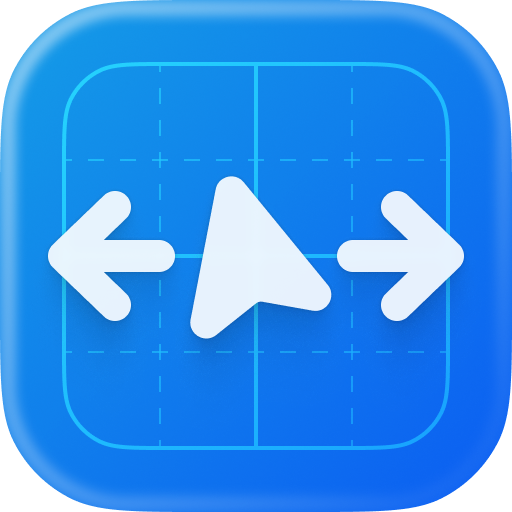
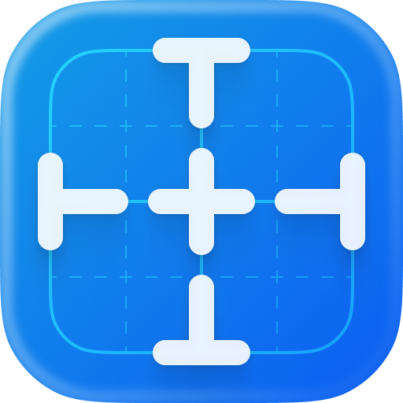
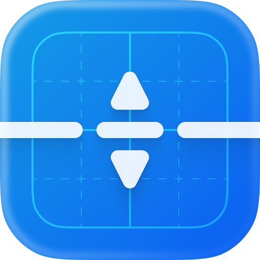

<div align="center">
  <picture>
    <source media="(prefers-color-scheme: dark)" srcset="assets/design-ruler-icon@dark.png">
    
  </picture>

  # Design Ruler

  **Pixel-perfect measurement and alignment for macOS.**

  Design Ruler gives you two fullscreen overlay tools for inspecting UI: one for measuring pixel distances with automatic edge detection, and one for placing alignment guides anywhere on screen. Works across all monitors.

  Available as a **standalone menu bar app** or a **Raycast extension**.
</div>

---

## Install

### Standalone App

Download the latest DMG from [GitHub Releases](https://github.com/haythemgataa/design-ruler/releases), open it, and drag Design Ruler to Applications. The app lives in your menu bar — no Dock icon, no Cmd+Tab entry.

### Raycast Extension

Install from the [Raycast Store](https://www.raycast.com/store) or build from source with `ray build`.

---

## Commands

### <picture><source media="(prefers-color-scheme: dark)" srcset="assets/measure-icon@dark.png"></picture> Measure

Freeze your screen and measure pixel distances between any two edges — instantly.

- **Fullscreen overlay** with a frozen screenshot as background — no visual disruption
- **Automatic edge detection** scans outward from your cursor in all 4 directions
- **Live W × H pill** updates as you move, showing exact pixel dimensions
- **Crosshair renders in difference blend mode** — always visible on light and dark backgrounds
- **Arrow keys** skip to the next detected edge; **Shift + Arrow** brings it back
- **Drag to select a region** — snaps to detected edges, shakes if too small
- **Hover a selection** and click to remove it
- **Smart 1px border corrections** — configurable: smart (default), include, or none

### <picture><source media="(prefers-color-scheme: dark)" srcset="assets/alignment-guides-icon@dark.png"></picture> Alignment Guides

Place horizontal and vertical guide lines anywhere on screen to check element alignment.

- **Fullscreen overlay** — click anywhere to place a guide line
- **Tab** toggles between vertical and horizontal guide orientation
- **Spacebar** cycles through 5 color presets: dynamic, red, green, orange, blue
- **Color circle indicator** shows the current color and fades after ~1 second
- **Hover a placed line** to enter remove mode — it turns red and dashed with a "Remove" pill
- **Click a hovered line** to remove it (shrink-to-point animation)
- **Position pill** on each placed line shows its exact X or Y coordinate

---

## Shared Features

- **Multi-monitor support** — one overlay window per screen; cursor determines which is active
- **Hint bar** — glass panel with keyboard shortcut illustrations, expands on launch then collapses
- **Inactivity watchdog** — auto-exits after 10 minutes
- **ESC** to exit from either command, cleanly restoring cursor state
- **Low CPU** — all rendering via Core Animation GPU compositing, target <5% during mouse movement

---

## Standalone App Features

### Menu Bar
Click the ruler icon in the menu bar to launch either command. The icon fills in while an overlay is active.

### Global Keyboard Shortcuts
Assign custom hotkeys to Measure and Alignment Guides in Settings. Hotkeys work from any application. Press the same hotkey while an overlay is active to dismiss it, or press the other command's hotkey to switch.

### Settings
Open from the menu bar dropdown. Configure:
- **General** — Launch at Login
- **Measure** — Hide Hint Bar, Border Corrections mode
- **Shortcuts** — Record custom keyboard shortcuts for each command
- **About** — Version info, check for updates

### Auto-Updates
Design Ruler uses [Sparkle](https://sparkle-project.org) to check for updates automatically. You can also check manually from the menu bar.

---

## Preferences

### Standalone App (Settings Window)
| Setting | Section | Options | Description |
|---|---|---|---|
| Launch at Login | General | On / Off | Start Design Ruler when you log in |
| Hide Hint Bar | Measure | On / Off | Hide the keyboard shortcut hint bar |
| Corrections | Measure | Smart / Include / None | How 1px borders are handled in measurements |
| Measure Shortcut | Shortcuts | Key combo | Global hotkey for Measure |
| Alignment Guides Shortcut | Shortcuts | Key combo | Global hotkey for Alignment Guides |
| Auto-check for Updates | About | On / Off | Sparkle automatic update checks |

### Raycast Extension
| Preference | Command | Options | Description |
|---|---|---|---|
| Hide Hint Bar | Both | On / Off | Hide the keyboard shortcut hint bar |
| Corrections | Measure | Smart / Include / None | How 1px borders are handled in measurements |

---

## Keyboard Reference

### <picture><source media="(prefers-color-scheme: dark)" srcset="assets/measure-icon@dark.png"></picture> Measure

| Key | Action |
|---|---|
| Arrow keys | Skip to next detected edge |
| Shift + Arrow | Un-skip (move edge closer) |
| Mouse move | Reset all skip counts |
| Drag | Select a region (snaps to edges) |
| ESC | Exit |

### <picture><source media="(prefers-color-scheme: dark)" srcset="assets/alignment-guides-icon@dark.png"></picture> Alignment Guides

| Key | Action |
|---|---|
| Tab | Toggle guide direction (vertical ↔ horizontal) |
| Spacebar | Cycle color preset |
| Click | Place guide line |
| Click (on hovered line) | Remove guide line |
| ESC | Exit |

---

## Building from Source

**Requirements:** macOS 14+, Xcode 15+, [xcodegen](https://github.com/yonaskolb/XcodeGen)

### Standalone App
```bash
cd App
xcodegen generate
xcodebuild -project "Design Ruler.xcodeproj" -scheme "Design Ruler" -configuration Debug build
```

### Raycast Extension
```bash
ray build
```

Both targets share the same Swift overlay code via the `DesignRulerCore` SPM library.
