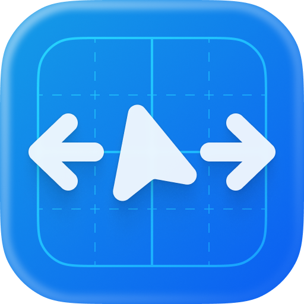
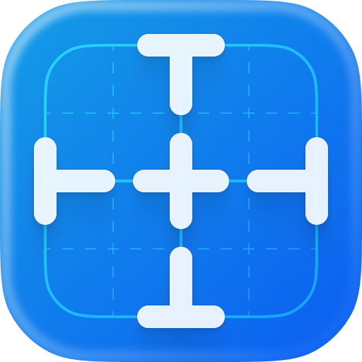
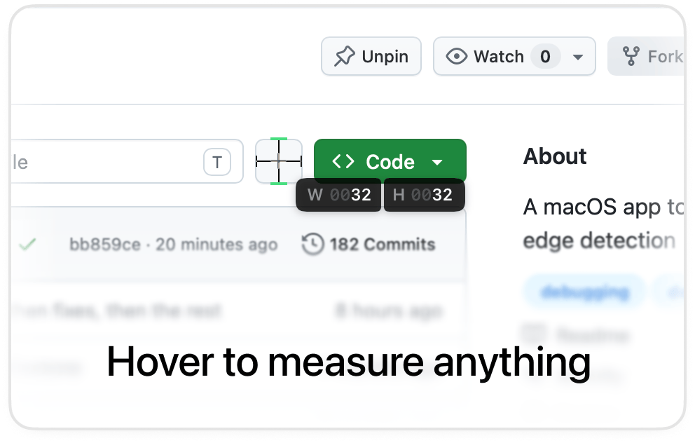
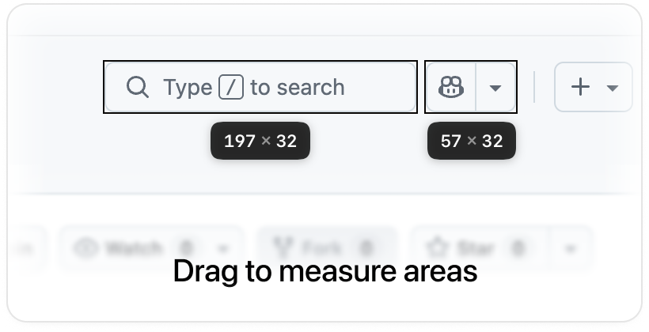
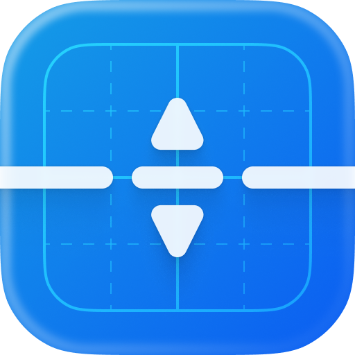
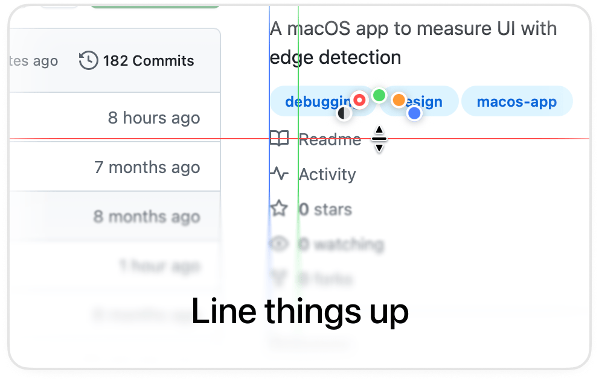
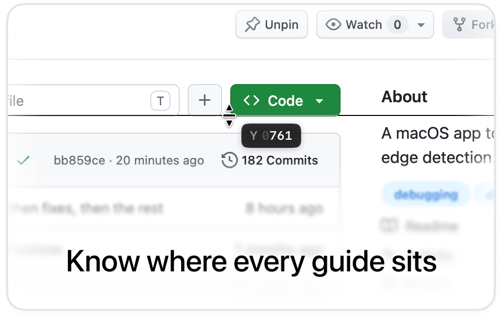

<div align="center">
  <picture>
    <source media="(prefers-color-scheme: dark)" srcset="assets/design-ruler-icon@dark.png">
    
  </picture>

  # Design Ruler

  **Pixel-perfect measurement and alignment for macOS.**

  Design Ruler gives you two fullscreen overlay tools for inspecting UI: one for measuring pixel distances with automatic edge detection, and one for placing alignment guides anywhere on screen. Zoom to 4x to work pixel by pixel. Works across all monitors.

  Available as a **standalone menu bar app** or a **Raycast extension**.

  <a href="https://github.com/haythemgataa/design-ruler/releases"></a>
  
</div>

---

## Download & Install

### Standalone App

**[Download the latest DMG](https://github.com/haythemgataa/design-ruler/releases)** from GitHub Releases. Requires macOS 14 Sonoma or later.

1. Open the DMG and drag **Design Ruler** to Applications.
2. Open it. The beta isn't signed with a Developer ID yet, so macOS blocks it the first time: go to **System Settings → Privacy & Security** and click **Open Anyway**, or run:
   ```bash
   xattr -dr com.apple.quarantine "/Applications/Design Ruler.app"
   ```
3. A short welcome walks you through **Screen Recording** and keyboard shortcuts. Each new beta build needs Screen Recording again: if an older build was installed, remove Design Ruler from **System Settings → Privacy & Security → Screen Recording** with **−**, then add it again with **+**.

Design Ruler lives in the menu bar, with no Dock icon or Cmd+Tab entry. Change keyboard shortcuts in **Settings**. The beta can't update itself yet: **Check GitHub for Updates** in the menu bar opens the releases page.

### Raycast Extension

Not in the [Raycast Store](https://www.raycast.com/store) yet. With Raycast installed, build it from source:

```bash
git clone https://github.com/haythemgataa/design-ruler.git
cd design-ruler
npm install
npm run dev   # builds the Swift package and loads Measure / Alignment Guides into Raycast
```

---

## Commands

### <picture><source media="(prefers-color-scheme: dark)" srcset="assets/measure-icon@dark.png"></picture> Measure

Freeze your screen and measure pixel distances between any two edges — instantly.

<p align="center">
  
  
</p>

- **Fullscreen overlay** with a frozen screenshot as background — no visual disruption
- **Automatic edge detection** scans outward from your cursor in all 4 directions
- **Live W × H pill** updates as you move, showing exact pixel dimensions
- **Crosshair renders in difference blend mode** — always visible on light and dark backgrounds
- **Arrow keys** skip to the next detected edge; **Shift + Arrow** brings it back
- **Drag to select a region** — snaps to detected edges, shakes if too small
- **Hover a selection** and click to remove it
- **Count 1px borders** — Smart (default) counts them or not, whichever fits the 4px grid; or Always / Never. A green tick marks an edge where a border was counted
- **Zoom-aware** — edge detection, crosshair, and selections stay accurate at 2x and 4x; arrow-key skipping peek-pans to reveal edges outside the zoomed viewport

### <picture><source media="(prefers-color-scheme: dark)" srcset="assets/alignment-guides-icon@dark.png"></picture> Alignment Guides

Place horizontal and vertical guide lines anywhere on screen to check element alignment.

<p align="center">
  
  
</p>

- **Fullscreen overlay** — click anywhere to place a guide line
- **Tab** toggles between vertical and horizontal guide orientation
- **Spacebar** cycles through 5 color presets: dynamic, red, green, orange, blue
- **Color circle indicator** shows the current color and fades after ~1 second
- **Hover a placed line** to enter remove mode — it turns red and dashed with a "Remove" pill
- **Click a hovered line** to remove it (shrink-to-point animation)
- **Position pill** on the line you're placing shows its exact X or Y coordinate
- **Zoom-aware** — guide lines are stored in capture space, so they stay pinned to the same pixels at 2x and 4x

---

## Shared Features

### Zoom

Press **Z** in either command to magnify the frozen screenshot. Available in both Measure and Alignment Guides.

- **Cycles 1x → 2x → 4x → 1x** on each press, animating over 0.25s
- **Anchored on the cursor** — the pixel under your cursor stays put as the zoom level changes
- **Crisp pixels** — nearest-neighbor magnification, so individual pixels stay sharp instead of blurring
- **Pans as you move** — the view follows the cursor 1:1 while zoomed, clamped to the screenshot bounds
- **Overlay UI stays screen-sized** — the crosshair, pills, guide lines, and hint bar don't scale with the content
- **Zoom level feedback** — the hint bar's Z keycap flashes the current level; a pill shows it instead when the hint bar is hidden
- **Per-screen** — each monitor's overlay has its own zoom state, and moving to another screen resets the one you left
- **Resets on exit** — ESC returns everything to 1x

### Overlay Behavior

- **Multi-monitor support** — one overlay window per screen; cursor determines which is active
- **Hint bar** — glass panel with keyboard shortcut illustrations, expands on launch then collapses
- **Inactivity watchdog** — auto-exits after 10 minutes
- **ESC** to exit from either command, cleanly restoring cursor state
- **Low CPU** — all rendering via Core Animation GPU compositing, target <5% during mouse movement

---

## Standalone App Features

### Menu Bar
Click the Design Ruler icon in the menu bar to launch either command, open Settings, or check for updates. Assigned keyboard shortcuts show next to each command.

### Global Keyboard Shortcuts
Assign custom hotkeys to Measure and Alignment Guides in Settings. Hotkeys work from any application. Press the same hotkey while an overlay is active to dismiss it, or press the other command's hotkey to switch.

### Settings
Open from the menu bar dropdown. Three tabs:
- **General** — version info and manual update check, Launch at Login, Show Hint Bar, Check for Updates Automatically, GitHub link
- **Measure** — Measure shortcut, Count 1px Borders
- **Alignment** — Alignment Guides shortcut, Remember Color and Direction

### Updates
Signed releases update themselves with [Sparkle](https://sparkle-project.org), automatically or from **Check for Updates…** in the menu bar. The current beta builds are unsigned and can't: **Check GitHub for Updates…** opens the releases page instead.

---

## Preferences

### Standalone App (Settings Window)
| Setting | Tab | Options | Description |
|---|---|---|---|
| Launch at Login | General | On / Off | Start Design Ruler when you log in |
| Show Hint Bar | General | On (default) / Off | Show the keyboard shortcut hint bar (both commands) |
| Check for Updates Automatically | General | On / Off | Sparkle automatic update checks |
| Measure Shortcut | Measure | Key combo | Global hotkey for Measure |
| Count 1px Borders | Measure | Smart / Always / Never | Whether 1px borders count in measurements; Smart counts them or not, whichever fits the 4px grid. A green tick marks an edge where a border was counted |
| Alignment Guides Shortcut | Alignment | Key combo | Global hotkey for Alignment Guides |
| Remember Color and Direction | Alignment | On / Off (default) | Start each session with the guide color and direction you used last |

### Raycast Extension
| Preference | Command | Options | Description |
|---|---|---|---|
| Show Hint Bar | Both | On (default) / Off | Show the keyboard shortcut hint bar |
| Count 1px Borders | Measure | Smart / Always / Never | Whether 1px borders count in measurements |

---

## Keyboard Reference

### <picture><source media="(prefers-color-scheme: dark)" srcset="assets/measure-icon@dark.png"></picture> Measure

| Key | Action |
|---|---|
| Arrow keys | Skip to next detected edge |
| Shift + Arrow | Un-skip (move edge closer) |
| Mouse move | Reset all skip counts |
| Drag | Select a region (snaps to edges) |
| Z | Cycle zoom (1x → 2x → 4x → 1x) |
| ESC | Exit |

### <picture><source media="(prefers-color-scheme: dark)" srcset="assets/alignment-guides-icon@dark.png"></picture> Alignment Guides

| Key | Action |
|---|---|
| Tab | Toggle guide direction (vertical ↔ horizontal) |
| Spacebar | Cycle color preset |
| Click | Place guide line |
| Click (on hovered line) | Remove guide line |
| Z | Cycle zoom (1x → 2x → 4x → 1x) |
| ESC | Exit |

---

## Building from Source

**Requirements:** macOS 14+ to run; Xcode 26+ (macOS 26 SDK) to build, [xcodegen](https://github.com/yonaskolb/XcodeGen)

### Standalone App
```bash
cd App
xcodegen generate
xcodebuild -project "Design Ruler.xcodeproj" -scheme "Design Ruler" -configuration Debug \
  -derivedDataPath DerivedData build
open "DerivedData/Build/Products/Debug/Design Ruler.app"
```

Debug builds are ad-hoc signed, so macOS may ask for Screen Recording permission again after a rebuild. If the overlay comes up black, run `tccutil reset ScreenCapture cv.haythem.designruler` and relaunch.

### Raycast Extension
```bash
npm install
npm run dev   # builds the Swift package and loads Measure / Alignment Guides into Raycast
```

Both targets share the same Swift overlay code via the `DesignRulerCore` SPM library.

### Test Builds
Every push to `main` and every pull request builds an unsigned test DMG. Download it from the workflow run's **Artifacts** section under [Actions → CI](https://github.com/haythemgataa/design-ruler/actions/workflows/ci.yml). macOS blocks unsigned apps on first open: use **System Settings → Privacy & Security → Open Anyway**, or run `xattr -dr com.apple.quarantine "/Applications/Design Ruler.app"`. Screen Recording permission has to be granted again for each new test build: if an older build was installed, remove Design Ruler from **System Settings → Privacy & Security → Screen Recording** with **−**, then add it again with **+**.
